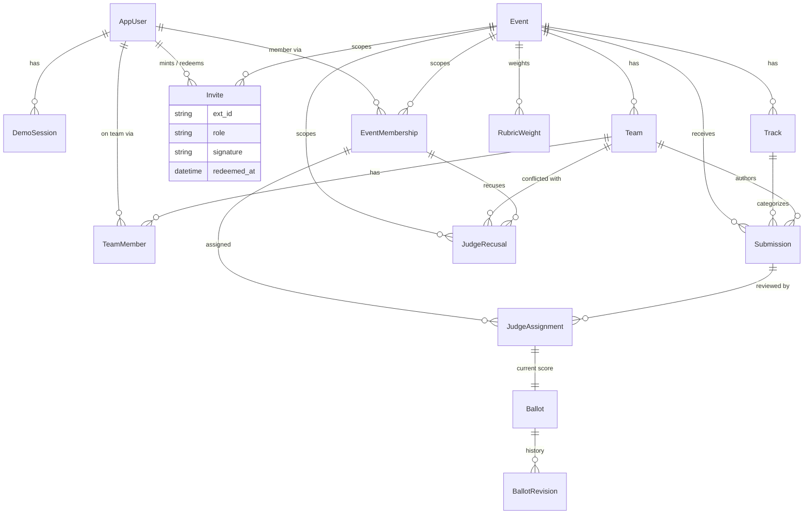
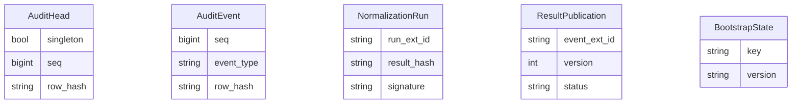
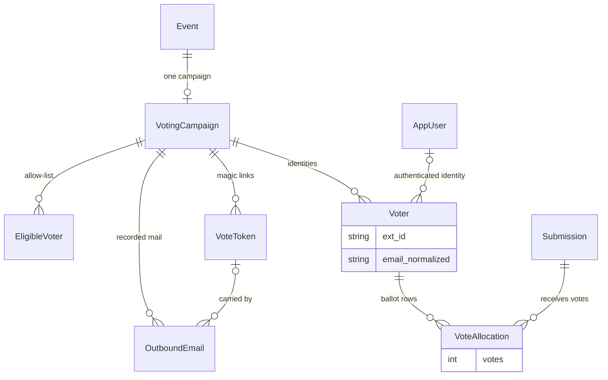
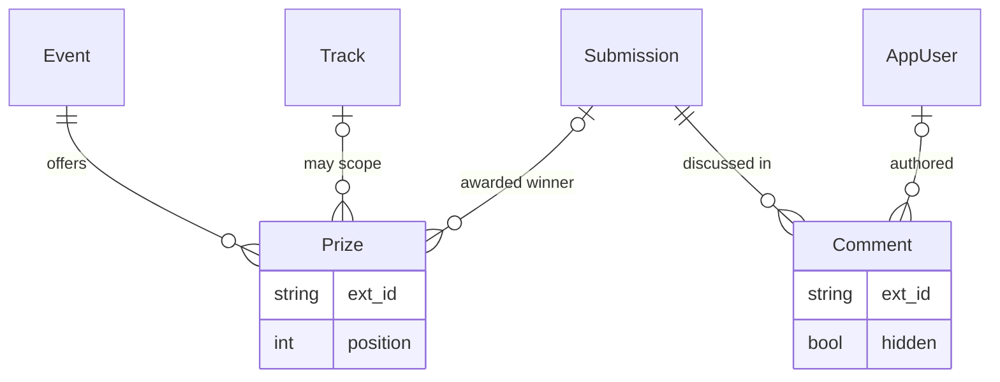
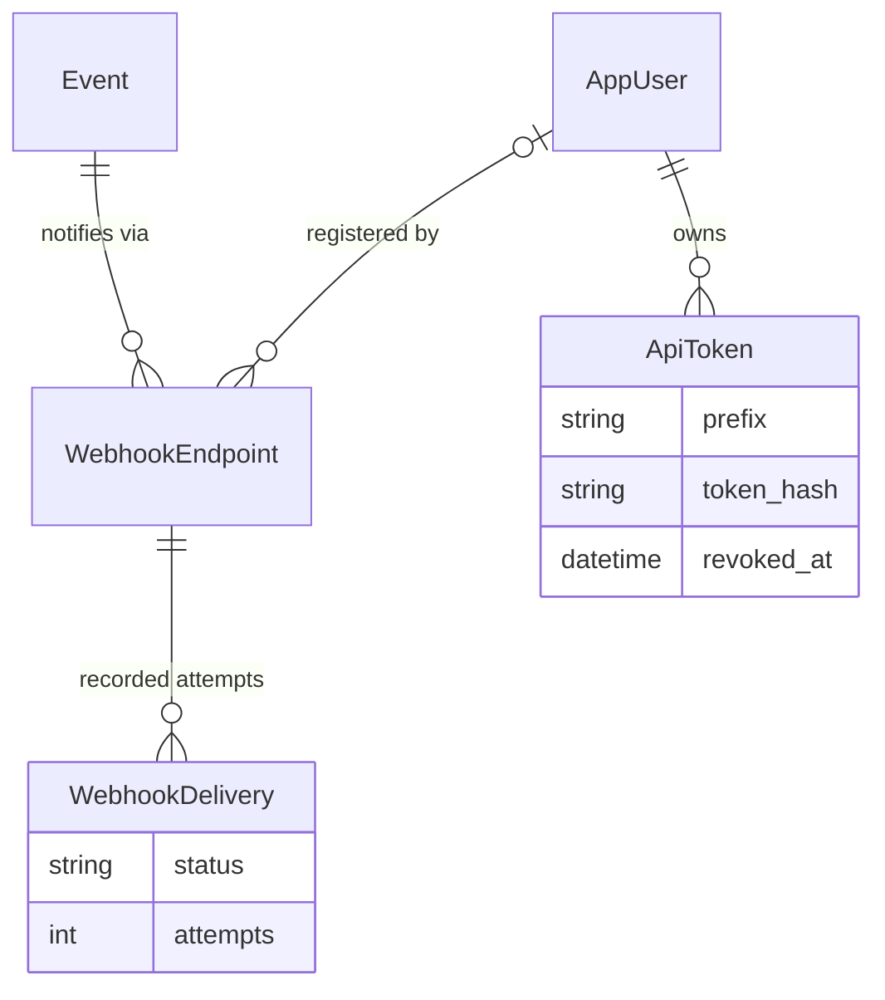

# Data model

Thirty models across eleven model-owning apps: `accounts` (2), `apitokens` (1), `audit` (2),
`awards` (1), `comments` (1), `events` (7), `judging` (5), `normalize` (2), `submissions` (1),
`voting` (6), `webhooks` (2). Five apps define **no** models — `api`, `bundles`, `embed`, `records`,
and `gallery` (whose `models.py` is an empty stub and whose `migrations/` holds only `__init__.py`)
— and neither does the `portal` project package. Every migration is **hand-authored** to match its
models, and the image build runs `manage.py makemigrations --check`, so a model and its migration
cannot silently drift. There are **no composite foreign keys, no database triggers, no `RunSQL` DDL,
and no `citext`** anywhere — every constraint below is an ordinary Django `UniqueConstraint` /
`CheckConstraint` or a single-column foreign key.

**Legend.** *live* = read or written by an HTTP endpoint; *seed* = populated by the `dogfood_import`
seed and not created or edited through any endpoint yet; *cli* = rows created only by a `manage.py`
command, never by an HTTP endpoint.

## `accounts`

### `AppUser` — table `app_user` — live (login)
`AbstractBaseUser` + `PermissionsMixin`; `AUTH_USER_MODEL = "accounts.AppUser"`.

| Field | Type | Notes |
|-------|------|-------|
| `email` | `EmailField(254)` | `unique=True` (required for Django's `auth.E003` check) |
| `display_name` | `TextField` | blank default |
| `is_active`, `is_staff`, `is_superuser` | `BooleanField` | `is_superuser` via `PermissionsMixin` |
| `date_joined` | `DateTimeField` | default `timezone.now` |
| `password`, `last_login`, `groups`, `user_permissions` | — | from the base classes |

Constraint `app_user_email_ci_unique` = `UniqueConstraint(Lower("email"))` — case-insensitive email
uniqueness without `citext`; `get_by_natural_key` uses `email__iexact`, so signup and login agree.

### `DemoSession` — table `demo_session` — live (DEMO auth)
`token` `CharField(64)` `unique=True`; `user` FK -> `AppUser` (CASCADE); `label` `CharField(32)`.
Resolved by `DemoAuthMiddleware` only when `DOGFOOD_DEMO` is on; empty in production.

## `audit`

Neither table has a foreign key; both are keyed by string identifiers so an exported chain is
portable and re-verifiable offline.

### `AuditHead` — table `audit_head` — live (integrity) — singleton
| Field | Type | Notes |
|-------|------|-------|
| `singleton` | `BooleanField` | `unique=True`, `editable=False`, default `True` — enforces one row |
| `instance_id` | `CharField(64)` | per-deployment id |
| `seq` | `BigIntegerField` | last committed seq (next = seq+1), default 0 |
| `row_hash` | `CharField(64)` | chain tip hash, default `GENESIS_HASH` (`"0"*64`) |
| `created_at`, `updated_at` | `DateTimeField` | |

Seeded once by a migration; every append locks this row `FOR UPDATE` so seq issuance never races.

### `AuditEvent` — table `audit_event` — live (integrity) — append-only
| Field | Type | Notes |
|-------|------|-------|
| `schema_version` | `IntegerField` | default `SCHEMA_VERSION` (1) |
| `instance_id` | `CharField(64)` | |
| `seq` | `BigIntegerField` | contiguous per instance |
| `event_type`, `object_type` | `CharField(64)` | e.g. `ballot.recorded` / `ballot` |
| `object_id` | `CharField(128)` | |
| `actor_user_id`, `actor_membership_id` | `CharField(64)` | blank default |
| `occurred_at` | `CharField(40)` | canonical ISO-8601 **string** exactly as hashed (not a `DateTimeField`) |
| `payload` | `JSONField` | default `dict`; canonical bytes sort keys before hashing |
| `payload_hash`, `prev_hash`, `row_hash` | `CharField(64)` | the SHA-256 chain (`prev_hash` -> `row_hash`) |
| `created_at` | `DateTimeField` | wall clock, **not** part of the hash |

Constraint `uniq_audit_instance_seq` = `UniqueConstraint(instance_id, seq)`; `Meta.ordering = ["seq"]`.
The hashed fields are strings so `python -m audit.verify` can replay the chain byte-for-byte offline.

## `events`

### `Event` — table `event` — live (read) / seed (create)
| Field | Type | Notes |
|-------|------|-------|
| `ext_id` | `CharField(64)` | `unique=True` (mirrors fixture ids) |
| `name` | `CharField(200)` | |
| `state` | `CharField(16)` | `setup` / `open` / `closed`, default `setup` |
| `submissions_close` | `DateTimeField` | deadline enforced in the service layer, not by a DB trigger |
| `results_published` | `BooleanField` | |
| `created_at` | `DateTimeField` | |

`accepting_submissions(now)` = `state == "open" and now < submissions_close`. The app is effectively
single-event: callers resolve the current event with `Event.objects.order_by("id").first()`.

### `EventMembership` — table `event_membership` — live (authorization) / seed
`user` FK -> `AppUser`; `event` FK -> `Event`; `role` `CharField(16)`
(`organizer` / `judge` / `participant`); `ext_id` `CharField(64)` blank (e.g. `jdg_01`). Constraint
`uniq_user_event_role` = `UniqueConstraint(user, event, role)`. **This table is the sole source of
authorization** — there are no global "is organizer / is judge" user flags.

### `Invite` — table `invite` — live (create + redeem)
A signed, single-use invitation to join an event as a judge or participant. `ext_id`
(`unique=True`, `inv_<uuid16>`); `event` FK (CASCADE); `role` `CharField(16)` — **`judge` /
`participant` only**, never `organizer`, so a shared link can add a member but can never mint an
organizer; `signature` `CharField(128)` = hex Ed25519 signature over the canonical
`(event_ext_id, invite_ext_id, role, expires_at)` tuple under domain tag `dogfood.invite.v1`,
signed with the **same `/state` key as the audit spine** (`events/invite_signing.py`); `created_by`
FK -> `AppUser` (CASCADE, the minting organizer); `created_at` (`auto_now_add`); `expires_at`
nullable (blank = never expires); `redeemed_at` nullable; `redeemed_by` FK -> `AppUser`
(`SET_NULL`, nullable). Single-use is a **DB** property, not a signature one: `redeem_invite` locks
the row `FOR UPDATE`, re-checks `redeemed_at` inside the transaction, then creates the
`EventMembership` + a `invite.redeemed` audit event atomically — two concurrent redemptions cannot
both grant. No `UNIQUE(event, role)`; an organizer mints as many links as needed. Offline-verifiable
with `manage.py invite_verify <ext_id>`.

### `Track` — table `track` — live (read) / seed
`ext_id` (`unique=True`), `event` FK (CASCADE), `name`. The `?track=` gallery filter and the submit
form both key off `ext_id`.

### `Team` — table `team` — live (read) / seed
`ext_id` (`unique=True`), `event` FK (CASCADE), `name`.

### `TeamMember` — table `team_member` — seed
`team` FK, `user` FK. Constraint `uniq_team_user` = `UniqueConstraint(team, user)`. The submission
service derives a participant's team from this table server-side; it is never taken from the client.

### `BootstrapState` — table `bootstrap_state` — seed
`key` (`unique=True`), `version`, `created_at`. A human-readable receipt that a seed of a given
version ran; read by `verify_demo`.

## `submissions`

### `Submission` — table `submission` — live (create + read)
| Field | Type | Notes |
|-------|------|-------|
| `ext_id` | `CharField(64)` | `unique=True` |
| `event` | FK -> `Event` | CASCADE |
| `team` | FK -> `Team` | CASCADE |
| `track` | FK -> `Track` | **PROTECT** (a track in use cannot be deleted out from under a project) |
| `title` | `CharField(200)` | |
| `summary` | `TextField` | blank default |
| `repo_url` | `URLField(500)` | blank default |
| `state` | `CharField(16)` | `draft` / `submitted` / `withdrawn`, default `draft` |
| `submitted_at` | `DateTimeField` | nullable |
| `created_at` | `DateTimeField` | |

`Meta.ordering = ["id"]`. **There is deliberately no `UNIQUE(team, track, title)`**: the fixture
plants a within-track duplicate (`prj_07` / `prj_41`) that must import cleanly, because duplicate
detection is a normalizer *diagnostic*, not a database guard. Beyond create, a team may revise or
**withdraw** its own submission while the event is still accepting writes (`/submissions/<id>/edit`,
`/submissions/<id>/withdraw`; owner- and deadline-gated, atomic + audited). Withdrawal is a soft
state change to `withdrawn` — the row is never deleted — so it drops out of the public gallery while
any ballot and audit history beneath it stays intact.

## `judging`

### `JudgeAssignment` — table `judge_assignment` — live (read + organizer-managed) / seed
`judge` FK -> `EventMembership`; `submission` FK -> `Submission`. Constraint `uniq_judge_submission`
= `UniqueConstraint(judge, submission)`. `judge_scores` reads only the caller's own assignments. An
organizer manages assignments in-app at `/judging/<event>/assignments` (`assign_judge` /
`unassign_judge`, atomic + audited); a **scored** assignment cannot be removed through the app or
admin, because its `Ballot` → `BallotRevision` history cascades off it (raw-DB access is the A8
operator boundary).

### `Ballot` — table `ballot` — live (read + write) / seed
`assignment` OneToOne -> `JudgeAssignment`; `functionality`, `quality`, `innovation`
(`PositiveSmallIntegerField`); `comment`. Constraint `ck_ballot_scores_1_5` requires each score in
`1..5` (migration `0002`). This row is a denormalized *latest-score pointer*; it is written only by
`judging.services.record_ballot`, reached over HTTP at `POST /judging/score`.

### `BallotRevision` — table `ballot_revision` — append-only (migration `0002`)
`ballot` FK (CASCADE, `related_name="revisions"`); `version` `PositiveIntegerField`; the three
scores; `comment`; `created_at`. Constraints `uniq_ballot_version` = `UniqueConstraint(ballot,
version)` (write-once per version) and `ck_ballotrevision_scores_1_5`. Migration `0002` backfills a
`v1` for every pre-existing ballot; a fresh seed writes `v1` directly. This is the tamper-evident
score history behind the denormalized `Ballot`.

### `RubricWeight` — table `rubric_weight` — seeded, organizer-editable
`event` FK; `criterion` `CharField(32)`; `weight` `FloatField` (default `1.0`). Constraints
`uniq_event_criterion` = `UniqueConstraint(event, criterion)` and — as of migration `0003` —
`ck_rubric_weight_nonneg` = `CheckConstraint(weight >= 0)`, the DB backstop behind
`set_rubric_weights` and the admin form's `clean_weight`, so a negative weight cannot be persisted
even by a writer that bypasses the service. A single weight **may** be `0` (drop a criterion); the
"not all zero" rule is cross-row and stays with the service plus the engine's `den == 0` guard, not
with this per-row check. Seeded with equal weights and editable by an organizer at
`/judging/<event>/rubric` (`set_rubric_weights`, atomic + audited `rubric.reweighted`); read live
only by the leaderboard preview and the next signed run, so re-weighting never rewrites an
already-published result. *(There is no `Rubric`, `Criterion`, or standalone `Score` table — scores
live on `Ballot` / `BallotRevision`.)*

### `JudgeRecusal` — table `judge_recusal` — live (organizer-managed) — migration `0004`
An organizer-declared conflict of interest: a judge will not review a given **team's** submissions.
`event` FK -> `Event` (CASCADE); `judge` FK -> `EventMembership` (CASCADE, `related_name="recusals"`);
`team` FK -> `Team` (CASCADE); `reason` `CharField(200)` blank default; `created_at`
(`auto_now_add`). Constraint `uniq_judge_recusal` = `UniqueConstraint(judge, team)`. Team-level
rather than submission-level on purpose, so the conflict also covers submissions that team files
later. Distinct from the auto-assignment planner's own-team exclusion (derived from `TeamMember`):
this records a conflict with a team the judge is **not** a member of. `judging/recusal.py` expands
each row to that team's current submission `ext_id`s at plan time, and the pure planner
(`judging/assignment.py`) consumes the per-submission form. Removing a recusal changes only who may
be planned — it touches no recorded ballot or its append-only history.

## `normalize`

Neither table has a foreign key: runs reference events and prior runs by string `ext_id`, and
`audit_seq` is a plain integer pointer into the audit chain — validated by the verifier, not trusted
as a database relation. This keeps a published run self-contained and re-verifiable offline. The
app's diagnostics add no tables: `normalize/duplicates.py` (within-track duplicate detection) is
pure Python with no Django import and **defines no model** — it reads the rows it is handed,
persists nothing, and is never fed back into a ranking or a hash.

### `NormalizationRun` — table `normalization_run` — live (written by command, read by views) — append-only
| Field | Type | Notes |
|-------|------|-------|
| `run_ext_id` | `CharField(40)` | `unique=True` |
| `engine_version`, `instance_id`, `event_ext_id` | `CharField` | `engine_version` pins the estimator schema |
| `inputs_hash`, `result_hash`, `fingerprint` | `CharField(64)` | SHA-256 / key fingerprint |
| `signature` | `CharField(128)` | Ed25519 over a domain-tagged pre-image |
| `lambda_value` | `FloatField` | the CV-selected ridge penalty |
| `n_boot`, `seed`, `audit_seq` | `PositiveIntegerField` | bootstrap count, RNG seed, audit pointer |
| `inputs`, `result` | `JSONField` | the frozen, signed payloads |
| `created_at` | `CharField(40)` | canonical string (part of the signed pre-image) |
| `recorded_at` | `DateTimeField` | wall clock |

`Meta.ordering = ["id"]`. Re-normalizing writes a **new** run; rows are never mutated, so the signed
history is complete.

### `ResultPublication` — table `result_publication` — live (migration `0002`) — append-only
`event_ext_id`; `run_ext_id`; `version` (`PositiveIntegerField`); `status` (`provisional` / `final`,
default `final`); `note`; `published_by`; `audit_seq`; `recorded_at`. Constraint
`uniq_event_result_version` = `UniqueConstraint(event_ext_id, version)`. The official result is the
highest-version row; publishing is the governance act that exposes a signed run at the **public**
`/normalize/results`.

## `comments`

### `Comment` — table `project_comment` — live (post + moderate)
A public discussion thread on a submission, with organizer moderation.

| Field | Type | Notes |
|-------|------|-------|
| `ext_id` | `CharField(64)` | `unique=True`, `cmt_<uuid16>` |
| `submission` | FK -> `Submission` | CASCADE, `related_name="comments"` |
| `author` | FK -> `AppUser` | **SET_NULL**, nullable, `related_name="comments_authored"` |
| `body` | `TextField` | unbounded column; the service caps input at `BODY_MAX = 2000` chars |
| `hidden` | `BooleanField` | default `False` — soft moderation state |
| `created_at` | `DateTimeField` | `auto_now_add` |

`Meta.ordering = ["id"]` (oldest-first, stable thread order). No `UniqueConstraint` and no
`CheckConstraint`: the `0001` migration is a single `CreateModel`. `author` is `SET_NULL` so a
comment **survives** the deletion of its author rather than the thread being silently rewritten;
posting always requires an authenticated author (view + `post_comment`), so a NULL author only ever
means "the account was later deleted", never "posted anonymously". Hiding flips `hidden` and never
deletes the row — `visible_comments` filters `hidden=False` at the data layer, so a moderated
comment drops out of every public read at once. Both writes are atomic and co-commit a
`comment.posted` / `comment.hidden` audit event. Endpoints: `GET/POST /comments/projects/<ext_id>`
and `POST /comments/<ext_id>/moderate`.

## `voting`

Community voting for one event, under its own `voting_*` tables. A voter spends a quadratic credit
budget (N votes on one project costs N² credits), and voter identity is enforced by database
constraints rather than trusted from the request. Roles stay event-scoped — nothing here adds a
global flag to `AppUser`.

### `VotingCampaign` — table `voting_campaign` — live (organizer-configured)
`ext_id` `CharField(64)` `unique=True` (`vcmp_<uuid16>`); `event` **OneToOne** -> `Event` (CASCADE,
`related_name="voting_campaign"`) — one campaign per event, enforced by the OneToOne's implied
`UNIQUE`; `mode` `CharField(16)` with choices `authenticated` / `email_link` / `email_gated`,
default `authenticated`; `credit_budget` `PositiveIntegerField` default `25`; `opens_at`,
`closes_at` `DateTimeField` (both required); `results_published` `BooleanField` default `False`;
`created_at` (`auto_now_add`). No extra constraints. `is_open(now)` is the half-open window
`[opens_at, closes_at)`; `results_visible(now)` requires **both** `results_published` and a closed
window, so an organizer cannot expose a tally mid-vote.

### `EligibleVoter` — table `voting_eligible_voter` — live (organizer allow-list)
`campaign` FK (CASCADE, `related_name="eligible_voters"`); `email` `EmailField`;
`email_normalized` `CharField(254)`; `created_at`. Constraint `uniq_eligible_campaign_email` =
`UniqueConstraint(campaign, email_normalized)`. Only consulted in `email_gated` mode: a confirmed
email voter whose normalized address is absent is refused at confirm time. `email_normalized` is the
dedup key produced by `voting.services.normalize_email`.

### `VoteToken` — table `voting_token` — live (email magic link)
`token` `CharField(64)` `unique=True` — a random `uuid4().hex`, not derived from the address, so
possession of the link is the proof of address control; `campaign` FK (CASCADE,
`related_name="tokens"`); `email` `EmailField`; `email_normalized` `CharField(254)`; `created_at`;
`confirmed_at` `DateTimeField` nullable. No extra constraints. Confirming at
`/voting/confirm/<token>` creates or reuses the `Voter` identity and stores it in the session.

### `Voter` — table `voting_voter` — live (one confirmed identity per campaign)
`ext_id` `CharField(64)` `unique=True` (`vtr_<uuid16>`); `campaign` FK (CASCADE,
`related_name="voters"`); `user` FK -> `AppUser` (CASCADE, **nullable**,
`related_name="voting_identities"`); `email` `EmailField` blank default; `email_normalized`
`CharField(254)` blank default; `created_at`. A row takes exactly one of two shapes — an
authenticated portal user (`user` set, email fields blank) or an email voter (`user` null,
`email_normalized` set). Two **partial** unique constraints are the "one vote per person" guard, and
they live in the database, not the view:

| Constraint | Definition |
|------------|------------|
| `uniq_voter_campaign_user` | `UniqueConstraint(campaign, user)` where `user IS NOT NULL` |
| `uniq_voter_campaign_email` | `UniqueConstraint(campaign, email_normalized)` where `email_normalized != ""` |

The normalized key (`services.normalize_email`) lowercases the address, drops a `+tag` subaddress on
**every** domain, and — for `gmail.com` / `googlemail.com` only — also deletes dots from the local
part and folds `googlemail.com` onto `gmail.com`, so an alias cannot register a second identity. It
is a dedup key only; `OutboundEmail.to` still carries the trimmed address exactly as entered.

### `VoteAllocation` — table `voting_allocation` — live (the ballot itself)
`voter` FK (CASCADE, `related_name="allocations"`); `submission` FK -> `Submission` (CASCADE,
`related_name="vote_allocations"`); `votes` `PositiveIntegerField` (no default — always written
explicitly); `created_at`. Constraint `uniq_allocation_voter_submission` =
`UniqueConstraint(voter, submission)`. The quadratic budget rule is **not** a DB check:
`cast_ballot` deletes the voter's whole allocation set and `bulk_create`s the new one inside one
transaction, so re-casting replaces rather than accumulates, and the `UNIQUE` holds at all times.
Window, eligibility, and budget are service gates (`VotingClosed` / `InvalidBallot` / `OverBudget`),
each paired with a `vote.cast` audit event.

### `OutboundEmail` — table `voting_outbound_email` — live (recorded, not delivered)
`campaign` FK (CASCADE, `related_name="emails"`); `token` FK -> `VoteToken` (**SET_NULL**, nullable,
`related_name="emails"`); `to` `EmailField`; `subject` `CharField(200)`; `body` `TextField`;
`created_at`. `Meta.ordering = ["-id"]`. No extra constraints. This deployment ships **no SMTP
integration**: the confirm message is persisted here and surfaced to the organizer/admin rather than
sent, which is exactly what the row means. It holds no secret beyond the single-use confirm token
already in the link.

## `awards`

Organizer-curated recognition layered on top of the results. A prize is **configuration, not an
integrity record**: awarding one never changes the judged, signed ranking and adds no cryptographic
property to it. The public podium page derives its ordering from the frozen, signed run
(`normalize.results.current_results`); this table stores only the prize catalogue and the
organizer's explicit winner pointer.

### `Prize` — table `prize` — live (organizer-managed)
| Field | Type | Notes |
|-------|------|-------|
| `ext_id` | `CharField(64)` | `unique=True`, `prz_<16 hex>` (`secrets.token_hex(8)`) |
| `event` | FK -> `Event` | CASCADE, `related_name="prizes"` |
| `track` | FK -> `Track` | **SET_NULL**, nullable — null means an event-wide prize |
| `name` | `CharField(200)` | |
| `description` | `TextField` | blank default |
| `position` | `PositiveSmallIntegerField` | default `1`; `1` = first place, `2` = second, …; **`0` = a special, non-podium award** |
| `awarded_submission` | FK -> `Submission` | **SET_NULL**, nullable — the organizer's explicit winner pointer |
| `created_at` | `DateTimeField` | `auto_now_add` |

`Meta.ordering = ["event_id", "track_id", "position", "id"]`. The `0001` migration is a single
`CreateModel` with **no** `AddConstraint`: there is no unique constraint and no check constraint on
this table. In particular, **the same-event invariant is not a database constraint** — that a
prize's `track` and `awarded_submission` belong to the prize's own `event` is enforced in the
service layer (`awards/services.py`: `create_prize` rejects an off-event track, `assign_winner`
rejects an off-event submission, both with `ValueError`). A raw-DB writer could therefore attach an
off-event row; the app path cannot. Both `SET_NULL` FKs mean deleting a track or a submission
degrades the prize to unscoped / unawarded rather than deleting it. When `awarded_submission` is
empty a podium-targeting prize (`position >= 1`) still resolves its winner from the frozen signed
result — event-wide, or within `track` when the prize is track-scoped; a `position = 0` special
award shows a winner only when an organizer assigned one. Unlike a ballot or a signed run, a prize
carries no append-only history, so `remove_prize` performs a real delete — with a
`prize.removed` audit event, alongside `prize.created` / `prize.winner_assigned` /
`prize.winner_cleared`. Endpoints live under `/events/<event>/awards` (public podium) and
`/events/<event>/awards/manage`, `…/topup` (organizer).

## `webhooks`

Organizer-registered outbound notifications for one event, under its own `webhook_*` tables. Honest
scope: there is **no async worker and no background queue**, so a delivery is attempted
synchronously and best-effort — never assured and never at-least-once. Each attempt is recorded as a
row, and an organizer can retry a failure by hand.

### `WebhookEndpoint` — table `webhook_endpoint` — live (organizer-managed)
`ext_id` `CharField(64)` `unique=True` (`whk_<uuid16>`); `event` FK -> `Event` (CASCADE,
`related_name="webhook_endpoints"`); `url` `URLField(500)`, validated by `webhooks.ssrf` before
creation and again immediately before each connection; `secret` `CharField(64)` — a
`secrets.token_hex(32)` string used only to HMAC-SHA256 the request body, shown once at creation and
masked thereafter; `active` `BooleanField` default `True`; `created_by` FK -> `AppUser`
(**SET_NULL**, nullable); `created_at`. Constraint `uniq_webhook_event_url` =
`UniqueConstraint(event, url)`. `active` exists so an endpoint can be switched off without losing
its recorded delivery history.

### `WebhookDelivery` — table `webhook_delivery` — live (one recorded attempt-bearing delivery)
| Field | Type | Notes |
|-------|------|-------|
| `ext_id` | `CharField(64)` | `unique=True`, `whd_<uuid16>` |
| `endpoint` | FK -> `WebhookEndpoint` | CASCADE, `related_name="deliveries"` |
| `event_type` | `CharField(64)` | |
| `payload` | `TextField` | the exact JSON body text that was signed and sent |
| `status` | `CharField(16)` | choices `pending` / `success` / `failed`, default `pending` |
| `attempts` | `PositiveIntegerField` | default `0` — initial attempt plus manual retries |
| `response_code` | `IntegerField` | nullable |
| `error` | `TextField` | blank default |
| `signature` | `CharField(128)` | blank default — the HMAC over `payload` |
| `created_at` | `DateTimeField` | `auto_now_add` |
| `last_attempt_at` | `DateTimeField` | nullable |

`Meta.ordering = ["-id"]` (newest-first for the organizer console). No unique or check constraint on
this table — the `0001` migration's only `AddConstraint` is `uniq_webhook_event_url` on the endpoint.
Storing `payload` verbatim is what lets the recorded `signature` be recomputed later. Every mutating
write co-commits a tamper-evident audit event in `webhooks/services.py`.

## `apitokens`

### `ApiToken` — table `api_token` — cli (mint) / live (Bearer verify)
A personal token authenticating one user for programmatic access.

| Field | Type | Notes |
|-------|------|-------|
| `ext_id` | `CharField(64)` | `unique=True`, `tok_<16 hex>` (`secrets.token_hex(8)`) |
| `user` | FK -> `AppUser` | CASCADE, `related_name="api_tokens"` |
| `name` | `CharField(120)` | human label |
| `prefix` | `CharField(12)` | the first 12 chars of the raw token — **non-secret**, display only |
| `token_hash` | `CharField(64)` | `unique=True`; sha256 hex of the raw token |
| `created_at` | `DateTimeField` | `auto_now_add` |
| `last_used_at` | `DateTimeField` | nullable; stamped by the verifier |
| `revoked_at` | `DateTimeField` | nullable; **soft** revocation — the row is never deleted |

`Meta.ordering = ["-created_at"]`. The `0001` migration is a single `CreateModel` with no
`AddConstraint`; both unique properties (`ext_id`, `token_hash`) are column-level `unique=True`.
**Only the hash is stored.** `apitokens.tokens.generate_token` mints a raw string
(`"dgf_" + secrets.token_urlsafe(32)`), `create_token` returns it to the caller exactly once, and
nothing but `hash_token(raw)` reaches the database — so a database dump exposes hashes, not usable
credentials, and the raw form is unrecoverable from a row. `is_active` is a Python property
(`revoked_at is None`), not a column. `revoke_token` is scoped to the owning `user` and gated on
`revoked_at IS NULL`, so one user cannot revoke another's token and an original revocation time is
never overwritten. Rows are created only by `manage.py mint_api_token` — there is no HTTP create
endpoint; `resolve_token` (called from `BearerTokenAuthentication`) is wired onto the single
authenticated endpoint `/api/v1/me/`, and every other `/api/v1/` route stays authless.

## Entity-relationship diagrams

Solid edges are real single-column foreign keys. Thirty entities in one picture would be unreadable,
so the graph is split into a **core** diagram plus three feature-area diagrams; between them every
model appears at least once, and `AppUser`, `Event`, `Submission`, and `Track` reappear in the
feature diagrams as the core entities those areas hang off. `AuditHead`, `AuditEvent`,
`NormalizationRun`, `ResultPublication`, and `BootstrapState` carry **no** foreign keys — they
reference events and runs by string id and are shown standalone by design.

**Core: accounts, events, submissions, judging.**

**Standalone: the string-keyed integrity and seed tables (no foreign keys).**

**Community voting.** `Event` and `Submission` are the core entities this area hangs off.

**Recognition and discussion: awards, comments.**

**Integrations: webhooks, apitokens.**

