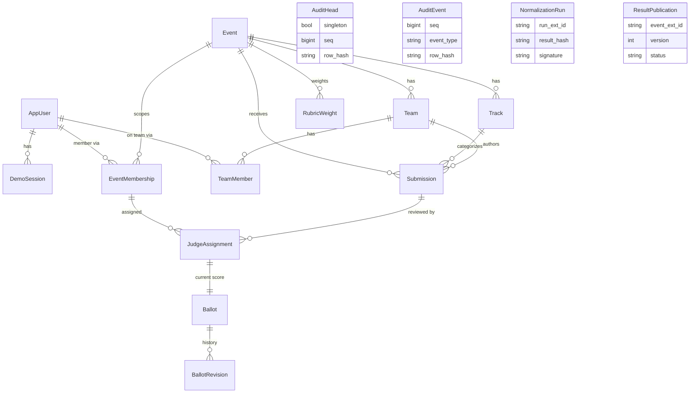

# Data model

Seventeen models across six domain apps (`gallery` and `portal` define no models). Every migration
is **hand-authored** to match its models, and the image build runs `manage.py makemigrations
--check`, so a model and its migration cannot silently drift. There are **no composite foreign keys,
no database triggers, no `RunSQL` DDL, and no `citext`** anywhere — every constraint below is an
ordinary Django `UniqueConstraint` / `CheckConstraint` or a single-column foreign key.

**Legend.** *live* = read or written by an HTTP endpoint; *seed* = populated by the `dogfood_import`
seed and not created or edited through any endpoint yet.

## `accounts`

### `AppUser` — table `app_user` — live (login)
`AbstractBaseUser` + `PermissionsMixin`; `AUTH_USER_MODEL = "accounts.AppUser"`.

| Field | Type | Notes |
|-------|------|-------|
| `email` | `EmailField(254)` | `unique=True` (required for Django's `auth.E003` check) |
| `display_name` | `TextField` | blank default |
| `is_active`, `is_staff`, `is_superuser` | `BooleanField` | `is_superuser` via `PermissionsMixin` |
| `date_joined` | `DateTimeField` | default `timezone.now` |
| `password`, `last_login`, `groups`, `user_permissions` | — | from the base classes |

Constraint `app_user_email_ci_unique` = `UniqueConstraint(Lower("email"))` — case-insensitive email
uniqueness without `citext`; `get_by_natural_key` uses `email__iexact`, so signup and login agree.

### `DemoSession` — table `demo_session` — live (DEMO auth)
`token` `CharField(64)` `unique=True`; `user` FK -> `AppUser` (CASCADE); `label` `CharField(32)`.
Resolved by `DemoAuthMiddleware` only when `DOGFOOD_DEMO` is on; empty in production.

## `audit`

Neither table has a foreign key; both are keyed by string identifiers so an exported chain is
portable and re-verifiable offline.

### `AuditHead` — table `audit_head` — live (integrity) — singleton
| Field | Type | Notes |
|-------|------|-------|
| `singleton` | `BooleanField` | `unique=True`, `editable=False`, default `True` — enforces one row |
| `instance_id` | `CharField(64)` | per-deployment id |
| `seq` | `BigIntegerField` | last committed seq (next = seq+1), default 0 |
| `row_hash` | `CharField(64)` | chain tip hash, default `GENESIS_HASH` (`"0"*64`) |
| `created_at`, `updated_at` | `DateTimeField` | |

Seeded once by a migration; every append locks this row `FOR UPDATE` so seq issuance never races.

### `AuditEvent` — table `audit_event` — live (integrity) — append-only
| Field | Type | Notes |
|-------|------|-------|
| `schema_version` | `IntegerField` | default `SCHEMA_VERSION` (1) |
| `instance_id` | `CharField(64)` | |
| `seq` | `BigIntegerField` | contiguous per instance |
| `event_type`, `object_type` | `CharField(64)` | e.g. `ballot.recorded` / `ballot` |
| `object_id` | `CharField(128)` | |
| `actor_user_id`, `actor_membership_id` | `CharField(64)` | blank default |
| `occurred_at` | `CharField(40)` | canonical ISO-8601 **string** exactly as hashed (not a `DateTimeField`) |
| `payload` | `JSONField` | default `dict`; canonical bytes sort keys before hashing |
| `payload_hash`, `prev_hash`, `row_hash` | `CharField(64)` | the SHA-256 chain (`prev_hash` -> `row_hash`) |
| `created_at` | `DateTimeField` | wall clock, **not** part of the hash |

Constraint `uniq_audit_instance_seq` = `UniqueConstraint(instance_id, seq)`; `Meta.ordering = ["seq"]`.
The hashed fields are strings so `python -m audit.verify` can replay the chain byte-for-byte offline.

## `events`

### `Event` — table `event` — live (read) / seed (create)
| Field | Type | Notes |
|-------|------|-------|
| `ext_id` | `CharField(64)` | `unique=True` (mirrors fixture ids) |
| `name` | `CharField(200)` | |
| `state` | `CharField(16)` | `setup` / `open` / `closed`, default `setup` |
| `submissions_close` | `DateTimeField` | deadline enforced in the service layer, not by a DB trigger |
| `results_published` | `BooleanField` | |
| `created_at` | `DateTimeField` | |

`accepting_submissions(now)` = `state == "open" and now < submissions_close`. The app is effectively
single-event: callers resolve the current event with `Event.objects.order_by("id").first()`.

### `EventMembership` — table `event_membership` — live (authorization) / seed
`user` FK -> `AppUser`; `event` FK -> `Event`; `role` `CharField(16)`
(`organizer` / `judge` / `participant`); `ext_id` `CharField(64)` blank (e.g. `jdg_01`). Constraint
`uniq_user_event_role` = `UniqueConstraint(user, event, role)`. **This table is the sole source of
authorization** — there are no global "is organizer / is judge" user flags.

### `Track` — table `track` — live (read) / seed
`ext_id` (`unique=True`), `event` FK (CASCADE), `name`. The `?track=` gallery filter and the submit
form both key off `ext_id`.

### `Team` — table `team` — live (read) / seed
`ext_id` (`unique=True`), `event` FK (CASCADE), `name`.

### `TeamMember` — table `team_member` — seed
`team` FK, `user` FK. Constraint `uniq_team_user` = `UniqueConstraint(team, user)`. The submission
service derives a participant's team from this table server-side; it is never taken from the client.

### `BootstrapState` — table `bootstrap_state` — seed
`key` (`unique=True`), `version`, `created_at`. A human-readable receipt that a seed of a given
version ran; read by `verify_demo`.

## `submissions`

### `Submission` — table `submission` — live (create + read)
| Field | Type | Notes |
|-------|------|-------|
| `ext_id` | `CharField(64)` | `unique=True` |
| `event` | FK -> `Event` | CASCADE |
| `team` | FK -> `Team` | CASCADE |
| `track` | FK -> `Track` | **PROTECT** (a track in use cannot be deleted out from under a project) |
| `title` | `CharField(200)` | |
| `summary` | `TextField` | blank default |
| `repo_url` | `URLField(500)` | blank default |
| `state` | `CharField(16)` | `draft` / `submitted`, default `draft` |
| `submitted_at` | `DateTimeField` | nullable |
| `created_at` | `DateTimeField` | |

`Meta.ordering = ["id"]`. **There is deliberately no `UNIQUE(team, track, title)`**: the fixture
plants a within-track duplicate (`prj_07` / `prj_41`) that must import cleanly, because duplicate
detection is a normalizer *diagnostic*, not a database guard. The write path is create-only — there
is no edit or withdraw route yet.

## `judging`

### `JudgeAssignment` — table `judge_assignment` — live (read) / seed
`judge` FK -> `EventMembership`; `submission` FK -> `Submission`. Constraint `uniq_judge_submission`
= `UniqueConstraint(judge, submission)`. `judge_scores` reads only the caller's own assignments;
there is no assignment-management UI yet.

### `Ballot` — table `ballot` — live (read + write) / seed
`assignment` OneToOne -> `JudgeAssignment`; `functionality`, `quality`, `innovation`
(`PositiveSmallIntegerField`); `comment`. Constraint `ck_ballot_scores_1_5` requires each score in
`1..5` (migration `0002`). This row is a denormalized *latest-score pointer*; it is written only by
`judging.services.record_ballot`, reached over HTTP at `POST /judging/score`.

### `BallotRevision` — table `ballot_revision` — append-only (migration `0002`)
`ballot` FK (CASCADE, `related_name="revisions"`); `version` `PositiveIntegerField`; the three
scores; `comment`; `created_at`. Constraints `uniq_ballot_version` = `UniqueConstraint(ballot,
version)` (write-once per version) and `ck_ballotrevision_scores_1_5`. Migration `0002` backfills a
`v1` for every pre-existing ballot; a fresh seed writes `v1` directly. This is the tamper-evident
score history behind the denormalized `Ballot`.

### `RubricWeight` — table `rubric_weight` — seed only
`event` FK; `criterion` `CharField(32)`; `weight` `FloatField` (default `1.0`). Constraint
`uniq_event_criterion` = `UniqueConstraint(event, criterion)`. Seeded with equal weights; there is no
weight-editing endpoint. *(There is no `Rubric`, `Criterion`, or standalone `Score` table — scores
live on `Ballot` / `BallotRevision`.)*

## `normalize`

Neither table has a foreign key: runs reference events and prior runs by string `ext_id`, and
`audit_seq` is a plain integer pointer into the audit chain — validated by the verifier, not trusted
as a database relation. This keeps a published run self-contained and re-verifiable offline.

### `NormalizationRun` — table `normalization_run` — live (written by command, read by views) — append-only
| Field | Type | Notes |
|-------|------|-------|
| `run_ext_id` | `CharField(40)` | `unique=True` |
| `engine_version`, `instance_id`, `event_ext_id` | `CharField` | `engine_version` pins the estimator schema |
| `inputs_hash`, `result_hash`, `fingerprint` | `CharField(64)` | SHA-256 / key fingerprint |
| `signature` | `CharField(128)` | Ed25519 over a domain-tagged pre-image |
| `lambda_value` | `FloatField` | the CV-selected ridge penalty |
| `n_boot`, `seed`, `audit_seq` | `PositiveIntegerField` | bootstrap count, RNG seed, audit pointer |
| `inputs`, `result` | `JSONField` | the frozen, signed payloads |
| `created_at` | `CharField(40)` | canonical string (part of the signed pre-image) |
| `recorded_at` | `DateTimeField` | wall clock |

`Meta.ordering = ["id"]`. Re-normalizing writes a **new** run; rows are never mutated, so the signed
history is complete.

### `ResultPublication` — table `result_publication` — live (migration `0002`) — append-only
`event_ext_id`; `run_ext_id`; `version` (`PositiveIntegerField`); `status` (`provisional` / `final`,
default `final`); `note`; `published_by`; `audit_seq`; `recorded_at`. Constraint
`uniq_event_result_version` = `UniqueConstraint(event_ext_id, version)`. The official result is the
highest-version row; publishing is the governance act that exposes a signed run at the **public**
`/normalize/results`.

## Entity-relationship diagram

Solid edges are real single-column foreign keys. `AuditHead`, `AuditEvent`, `NormalizationRun`, and
`ResultPublication` carry **no** foreign keys — they reference events and runs by string id and are
shown standalone by design.

